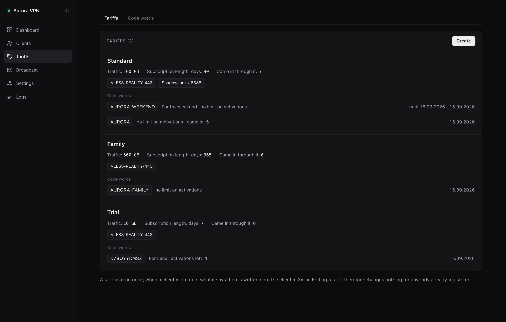
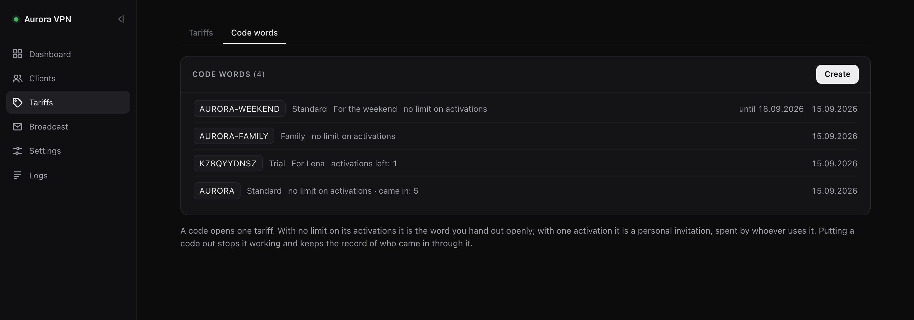

<h1 align="center">Mailchilla</h1>

<p align="center">
An email bot and web panel for <a href="https://github.com/MHSanaei/3x-ui">3x-ui</a>
</p>

<p align="center">


</p>

<p align="center">
English · <a href="README.ru.md">Русский</a>
</p>

---

Someone writes a letter with the code word - and gets a working subscription back. The administrator never opens 3x-ui.

The project started with a simple need: handing out subscriptions to people you know. Doing that by hand through the 3x-ui admin panel is miserable, and a Telegram bot is not an option either - how do you hand a subscription to somebody for whom Telegram is blocked? That is the shape of the problem in Russia: to reach the bot that would give you the subscription, you first need the subscription. Email works for everybody, with no VPN and nothing to get around. So email is what it was built on.


---

## Contents

- [Features](#-features)
- [Quick start](#-quick-start)
- [First run](#-first-run)
- [Tariffs](#-tariffs)
- [Settings](#-settings)
- [Reaching the panel](#-reaching-the-panel)
- [Managing it](#-managing-it)
- [Updating](#-updating)
- [How it is built](#-how-it-is-built)
- [Development](#-development)
- [License](#-license)

---

## 📬 Features

**📧 The email bot**

You write a letter with a command, in the subject or in the body - the bot handles it and answers.

| Command | What it does |
|---|---|
| the code word | creates the client in 3x-ui, sends back the subscription link |
| `/status` | traffic left, expiry, status |
| `/help` | instructions for setting up a client app |
| `/broadcast` | a letter to every active client (from the administrator only) |

The sender's name lands in the client's comment - the list then shows people rather than addresses. For everyone registered before that, one button on the Mail tab reads the names out of the letters already in the mailbox and offers a table of who to fill in.

**🖥️ The web panel**


- Tariffs: traffic, term and inbounds, each with its own code word. As many as you like, and a client made by hand can be stamped from one
- A client list with live search, sorting and filters (status, mail, connection, period, traffic)
- Who is connected right now shows as a dot beside the address - green breathes, red sits still - on the list, on a client's own page and in the broadcast's recipient list. It refreshes itself every twenty seconds without disturbing anything you are in the middle of
- **Last online**, as its own column and as a line on the card: minutes and hours while it is fresh, a date once it is past a week, a dash for somebody who has never connected. The exact moment is in the tooltip, and the column sorts, so the people who have stopped using the thing are two clicks away
- The dashboard opens with the machine itself: processor, memory, disk, uptime, xray's state and how many clients are connected right now. It can refresh itself every few seconds, or on the button. Beside it, how the mail loop is doing - a bot that has quietly stopped reading the mailbox otherwise looks exactly like a mailbox nobody writes to - and how many people are on each tariff, with what they have spent
- A client's card: traffic, expiry, subscription link and the inbounds they belong to - including ones switched off or gone from the panel
- Each inbound also carries its own ready-made connection URL, the same string 3x-ui's copy button hands out. One click copies it
- Creating a client by hand, changing the limit, the expiry or the set of inbounds, disabling an account
- Resending the invitation and writing a personal letter, straight from the card


**📢 Broadcasts**


A letter to chosen recipients or to every active client. Sending runs in the background, the page shows the progress, and closing the tab does not break it. The message kind sets the colour of the stripe in the letter: plain, information, warning, urgent.

The recipient list has search, filters (active, disabled, limit spent, traffic running low) and sorting. "All" and "None" act on whatever the filter left - so "everyone who ran out of traffic" is two movements.

And something completely unserious: the **Roulette** button rolls the visible recipients past like a CS:GO case opening, rarity colours and all, and leaves exactly one of them ticked. Rarity comes from traffic spent, so gold goes to the hungriest.

**📮 The mailbox**

The bot's own mailbox, from the panel: Inbox, Sent and Trash, with search by address, name or subject. Beside an open letter stands the client who wrote it - status, tariff, traffic, expiry and the word they came in through, a click away from their card - or a plain "not a client". In the list itself a client's letters carry their tariff, so the people you already serve stand out from the rest at a glance.

It only looks. Opening a letter does not mark it read, because an unread letter is how the bot knows it still owes somebody an answer. An HTML letter is drawn in a sealed frame where nothing in it runs, and pictures from other servers stay hidden until you ask for them - each one tells the sender the letter was opened. Attachments are downloaded, never opened in the panel.

SMTP keeps no copy of what it sends, so the bot now puts one of every letter into the Sent folder itself - unless the provider has already filed it, as Gmail does. Letters sent before the update are not there.

A second mailbox can join it: Support, set up on its own tab in Settings. Once it has both an IMAP and an SMTP half, a Support tab appears beside the bot's, and every letter there carries a reply box the bot's own mailbox does not offer - plain text, threaded under the letter it answers and quoting it underneath, filed into Support's own Sent folder the same way. Left unset, nothing about the Mail page changes.

**💌 The letters**


Table-based layout with inline styles, flat colours, a text version in every letter. It arrives looking the same in Gmail, on phones and in Outlook.

The welcome letter carries a QR code of the subscription link, for the reader who opened their mail on a computer and would otherwise be copying the link across to their phone by hand. It is drawn on the server and travels inside the letter - no QR service is handed everyone's subscription link.

The registration letter opens with what the subscription is: the tariff by name, the term and the traffic limit. The name is the one the client is actually on, read from their group in 3x-ui, so somebody already registered who writes another tariff's word is told what they still have rather than what the word would have given them. A client from before tariffs existed carries no group, and then the line is simply left out.

Two addresses of yours travel with the letters, both optional and both set on the General tab. The support address is in the footer of every letter and, in its own words, in the registration letter — where somebody is setting a connection up for the first time. It is a link to write to, so pressing it opens a new letter already addressed. The link to the instructions sits in the registration letter below every way of connecting — the buttons, the QR code, the link to copy — because reading about it comes after trying it.

Every text is editable from the panel: subjects, headings, captions, the footer, the service replies. Each letter has a test-send button. The parts that can be left out — the QR code, the link to the instructions, either support line — are framed blocks with a switch of their own, beside the text each one governs.


**📱 From a phone**


The panel is meant to be used from a phone, not merely to survive on one. The side menu becomes a bar along the bottom, where the links cost nothing horizontally and land where a thumb already is. Tables scroll sideways inside their own box rather than dragging the page with them, and the letter editor, the filters and the broadcast all fold into one column.

**🌍 Two languages**

The interface speaks English and Russian. So do the letters - and the two are chosen separately, so an English panel can send Russian letters. That is the usual case when you administer in one language and your users read another.

The interface strings live in `lang/`, the letter texts in the panel itself, one set per language. Editing the English welcome letter leaves the Russian one alone.

**📋 Logs and notifications**


The process log in the browser: filter by level, search, exception tracebacks. Unread warnings rise to the dashboard. A push to Gotify on every registration.

The panel also notices when a newer version has been released and says so in a banner, with a link to what changed and the command to run. It updates nothing by itself, and the check can be switched off.

---

## 🚀 Quick start

One command on a clean server with a reachable 3x-ui panel:

```bash
bash <(curl -Ls https://raw.githubusercontent.com/vogster/3x-ui-mailchilla-bot/main/install.sh)
```

The installer asks for the language first, then for access to 3x-ui and the sign-in for its own panel, and does the rest itself: packages, a system user, the latest released version into `/opt/mailchilla`, a virtual environment, `.env`, the systemd service and the `mailchilla` command. At the end it prints the address, the password and the tunnel command.

Debian 11+, Ubuntu 22.04+, CentOS/AlmaLinux/Rocky/Fedora. Python 3.9 or newer is required — Ubuntu 20.04 ships 3.8 and the installer will say so rather than leave a half-installed copy.

Running a script straight off the internet as root deserves a look first. If you would rather:

```bash
curl -LO https://raw.githubusercontent.com/vogster/3x-ui-mailchilla-bot/main/install.sh && less install.sh && sudo bash install.sh
```

<details>
<summary><b>Installing by hand</b></summary>

Python 3.9+, and a reachable 3x-ui panel.

```bash
git clone https://github.com/vogster/3x-ui-mailchilla-bot.git mailchilla
cd mailchilla
python3 -m venv venv
source venv/bin/activate
pip install -r requirements.txt
cp .env.example .env
# fill in XUI_URL, XUI_USERNAME, XUI_PASSWORD (or XUI_API_TOKEN)
# fill in ADMIN_PANEL_USER, ADMIN_PANEL_PASSWORD
# generate ADMIN_PANEL_SECRET: openssl rand -hex 32
python run.py
```

</details>

One command brings up both the bot and the panel. The panel is always raised - there is nowhere else to configure the project. To run the bot on its own: `python email_bot.py`.

`.env` holds only what is needed before the panel can come up: access to 3x-ui, the panel's own sign-in, its address and the logging settings. Everything else - the mailbox, the language, Gotify - is set in the panel after the first sign-in and kept in `settings.json`, and what a client gets lives in tariffs beside it.

---

## ⚙️ First run

A fresh copy knows nothing about your mailbox or your inbounds. After the first sign-in a banner at the top offers to walk through the setup.


The wizard goes step by step: service, mail, inbounds and the first tariff, then the optional notifications and app buttons. Every step saves at once - a closed tab loses nothing. The mail step has a working connection check.

"I will do it myself" dismisses the banner. The wizard is the same settings fields, laid out in order.

---

## 🎟️ Tariffs

A tariff is what a client gets: traffic, term and the inbounds they are added to. Each has its own code word, and a letter carrying that word registers the sender on that tariff. There can be as many tariffs as you like - a generous one for the family, a small one for a trial, one with no word at all that can only be reached another way.



| Field | What it means |
|---|---|
| Name | yours to read; it names the tariff in the panel and in the log |
| Code word | the word a letter must carry. Unique across tariffs, matched as a whole word |
| Traffic limit | in GB; 0 means unlimited |
| Subscription length | in days; 0 means it never expires |
| Inbounds | the client is added to each of them, in order |

The dashboard counts who is on which tariff and what they have spent, the broadcast can be narrowed to one tariff, and `/status` tells a client which one they are on. Every tariff and every code has a card of its own: a tariff's shows who is on it, a code's shows everybody who came in through that word - each a click away from their own client card.

**Who is on which tariff is kept in 3x-ui itself**, in the client's group, named after the tariff. Nothing has to be kept in step: the 3x-ui panel shows the same grouping, and a group changed there by hand is simply the truth. The client list shows the tariff beside the name and can filter by it, including "without one" - which is what anybody registered before tariffs existed will be. Renaming a tariff renames the group and carries its clients across, which is why two tariffs may not share a name. Deleting one leaves its clients exactly as they are: they hold their own limits, and the label they carry outlives the tariff - the list marks it with a dashed chip and the tariffs page counts such groups under "Groups without a tariff".

**A tariff is read once, when the client is created.** From that moment the values live on the client in 3x-ui, so editing a tariff changes nothing for anybody already registered - it describes the next client, not the last one.

Two details worth knowing about the word. It is matched whole, so `START` is not found inside `RESTART`; and it is looked for only in the part of a letter its sender actually typed, so a reply quoting the welcome letter does not count as a fresh registration. If one letter carries the words of two tariffs, the bot writes back and asks which is meant rather than guessing.

**Code words are a thing of their own**, on their own tab beside the tariffs. A code is a word, the tariff it opens, how many activations are left in it, a note for you, and a switch:



| Activations | What it is |
|---|---|
| empty | the word you hand out openly - works for everybody who writes it |
| 1 | a personal invitation - spent by whoever uses it first |
| any number | works that many times |

A code can also carry a date it works until - the last day, to the end of it. A word given out for a weekend stops on its own rather than waiting to be remembered on Monday; an empty date means it never runs out by itself. A code that has run out of activations or out of days stays on the list, struck through, with the record of who came in through it.

That number is the whole difference between the two, which is why there is one form for both. Press **Generate** for a word nobody could guess - ten characters with no `0`/`O` or `1`/`I` in them, since somebody will be typing it off a screen - or type a memorable one yourself.

A tariff can have several words: a seasonal one beside the permanent one, or one per group of people. Any of them can be switched off on its own the moment it leaks, without touching the tariff or the other words. Switching a code off keeps the record of who came in through it; removing it from the list throws that away.

If an address that is already registered uses a code, the code is not spent: they simply get their link again, and a personal invitation stays for the person it was meant for.

Somebody already registered who writes another tariff's word simply gets their subscription link again. Moving a client between tariffs is the administrator's decision, not something a more generous word can do for them.

Updating from 0.1.x needs nothing: the old code word, limit, term and inbounds become a tariff called "Basic" on the first start, and everybody registered before carries on untouched.

---

## 🔧 Settings

Everything that changes during normal use is set in the panel and applies on the fly, without a restart.


| Tab | What is inside |
|---|---|
| **General** | interface language, service name, subscription base address, administrator address, support address, link to the instructions |
| **Mail** | IMAP and SMTP: servers, ports, logins, passwords, polling interval, clearing the mailbox out, connection check |
| **Registration** | flow, and whether the sender's name is written into the client's comment. Traffic, term, inbounds and the code word belong to a tariff |
| **Apps** | the schemes behind the "Add to Happ / Incy" buttons in the letter |
| **Gotify** | server address, token, priority, notification text |
| **Letters** | the language letters go out in, every text of every letter, and a switch for each block that can be left out |

The Mail tab has a check: the panel signs in to the mailbox over IMAP and to SMTP with whatever is in the fields (no need to save first) and reports back step by step. If an administrator address is set, a test letter goes there too.

The same tab can keep the mailbox tidy. Nobody reads it — every letter in it has been answered already — and after a year of registrations it holds thousands. Switched on, the bot moves the read letters to the Trash every so many days, on the connection it is polling with anyway. Only read ones: the flag is set after a letter has been dealt with, so an unread letter is one still owed an answer, which after a spell of the mailbox being unreachable may be a registration that has not happened yet. Nothing is deleted outright, so a schedule set too eagerly can be undone from the mail client until the Trash empties itself.

Settings are kept in `settings.json`, the letter texts in `email_texts.json` and the tariffs in `tariffs.json`, all three beside the project. The mailbox is picked up on the next polling cycle.

**Secrets.** The mailbox passwords and the Gotify token are edited in the panel. Passwords are shown as dots and nothing else, the token keeps a few characters at either end so you can tell one from another, and either opens with the eye button. The real value never reaches the page markup, it is requested separately. `settings.json` therefore holds secrets: the file is in `.gitignore`, and it should not carry generous permissions.

---

## 🔐 Reaching the panel

By default `127.0.0.1:8080` - not reachable from outside.

```bash
ssh -L 8080:127.0.0.1:8080 user@your-server
```

Then open `http://localhost:8080`.


The alternative is a reverse proxy with HTTPS. Setting `ADMIN_PANEL_HOST=0.0.0.0` without one is a bad idea.

---

## 🖥️ Managing it

The `mailchilla` command opens a menu when run on its own, and takes the same actions as arguments — so it works by hand and from a script alike.

```bash
mailchilla
```

| | |
|---|---|
| `mailchilla status` | the service, the version, whether the panel answers |
| `mailchilla restart` | also `start`, `stop` |
| `mailchilla log` | the journal, following |
| `mailchilla update` | check for a new version and install it |
| `mailchilla passwd` | change the panel's username or password |
| `mailchilla port` | change the port |
| `mailchilla tunnel` | the ready-made SSH tunnel command |
| `mailchilla check` | sign in to 3x-ui and report back |
| `mailchilla backup` | copy the configuration to `/opt/mailchilla-backups` |
| `mailchilla uninstall` | remove everything |

`status` is not `systemctl is-active`: with `Restart=always` a service crash-looping still reads as running, so the panel is asked over HTTP instead.

Forgotten the panel password? It lives in `.env`, and without it the panel does not start at all — `mailchilla passwd` sets a new one and restarts.

<details>
<summary><b>A systemd unit for a manual installation</b></summary>

```ini
[Unit]
Description=Mailchilla
After=network-online.target
Wants=network-online.target

[Service]
Type=simple
User=bot
WorkingDirectory=/opt/mailchilla
ExecStart=/opt/mailchilla/venv/bin/python run.py
Restart=always
RestartSec=10

[Install]
WantedBy=multi-user.target
```

Two things that are easy to trip over:

- **Do not use `EnvironmentFile` for `.env`.** The application reads it itself through python-dotenv, and systemd parses such files by its own rules - two parsers on one file will disagree.
- **The user needs write access** to the project directory: `settings.json`, `email_texts.json`, `tariffs.json` and `logs/` are written there.

</details>

---

## ⬆️ Updating

```bash
mailchilla update
```

Versions are tags, not the tip of a branch: the command asks GitHub for the newest `vX.Y.Z`, shows what changed from `CHANGELOG.md` and waits for a yes.

Before touching anything it copies `.env`, `settings.json`, `email_texts.json` and `tariffs.json` to `/opt/mailchilla-backups/<date>/`. If the panel does not answer after the restart, it goes back to the previous version and restores them.

Files edited on the server — a template, say — are put aside with `git stash` rather than blocking the update; the command tells you how to get them back.

New settings and new letter texts need no migration: a key absent from `settings.json` falls back to the default in `config.py`, and `email_texts.json` stores only what actually differs from the shipped text. Tariffs need none either: an installation without `tariffs.json` gets one built out of the code word and limits it already had.

For a manual installation the old route still works: `git pull` and `systemctl restart`.

---

## 📁 How it is built

There is no database of its own. The source of truth is the 3x-ui panel, and client state is read from it. That rules out the two drifting apart, but it does mean the panel has to be reachable.

| File | What it is for |
|---|---|
| `install.sh` | the installer: one command, English or Russian |
| `mailchilla.sh` | managing an installed copy: the menu and the subcommands |
| `run.py` | the entry point: the bot in a background thread, the panel in the main one |
| `email_bot.py` | what a letter means: the commands, registrations, the letters sent back |
| `mailer.py` | sending: the MIME message, SMTP, the Gotify push |
| `inbox.py` | reading: the IMAP poll loop and the health of it |
| `mailfolders.py` | the mailbox as the panel shows it: folders, letters, copies of sent ones |
| `xui_client.py` | the 3x-ui API client |
| `templates.py` | assembling letters with Jinja2 - HTML and a text version |
| `email_texts.py` | the editable letter texts, one set per language |
| `i18n.py` | the interface translator: catalogue lookup and the two language settings |
| `lang/` | the interface catalogues, one module per language |
| `settings.py` | settings layered over `.env` |
| `tariffs.py` | the tariffs and the code words that open them |
| `config.py` | environment variables |
| `applog.py` | log collection into a buffer and a file |
| `admin/` | the FastAPI web panel |
| `email_templates/` | the letter templates |

---

## 🛠️ Development

Forks and pull requests are welcome. The main branch is `main`.

```bash
pip install -r requirements.txt -r requirements-dev.txt
python -m unittest discover -s tests   # what CI runs
```

Most of the tests are pure — the settings coercion, the code-word matching, the letter texts. `tests/test_panel_routes.py` is the other kind: it drives the panel through `fastapi.testclient` with 3x-ui stubbed out, and exists for one failure in particular — a template reading a context key the route never sent. Jinja resolves that to Undefined in silence, the page still renders, and the missing part is found by somebody clicking a week later. A new page or a new context key wants a line in that file.

```bash
git checkout -b feature/my-feature
# ...
git push origin feature/my-feature
# open a pull request on GitHub
```

---

## 📄 License

MIT — see [LICENSE](LICENSE).
