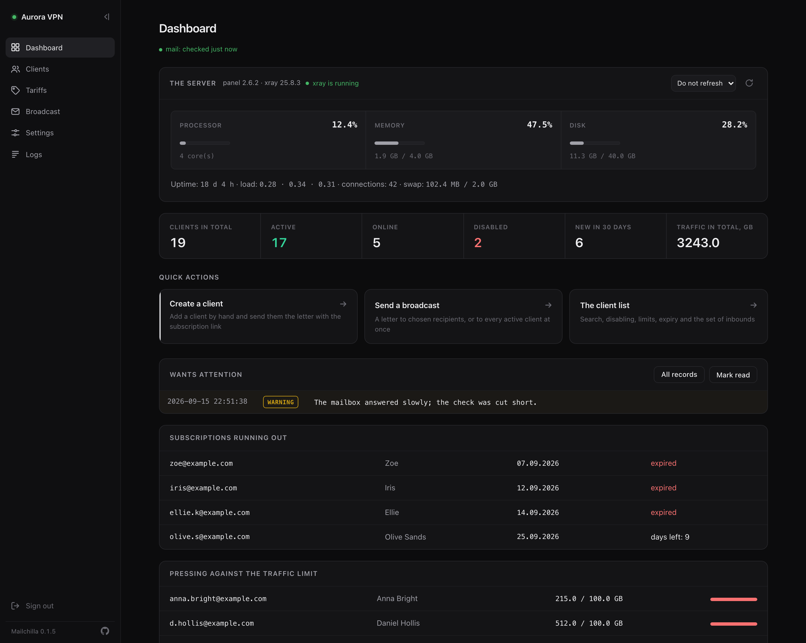
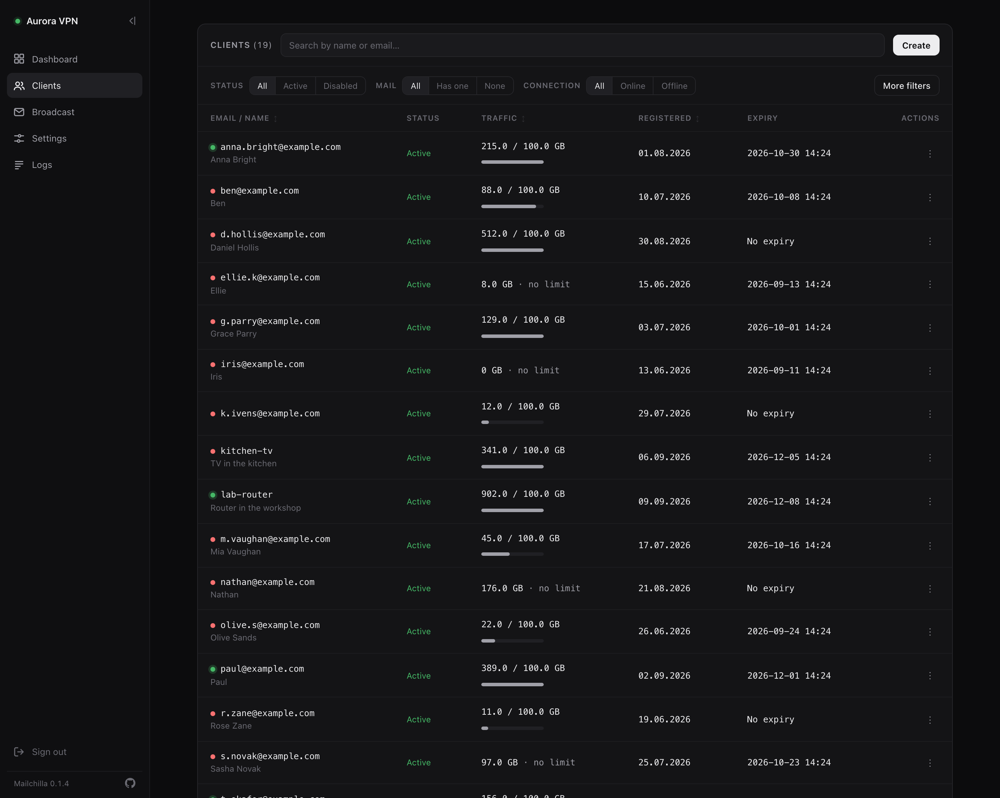
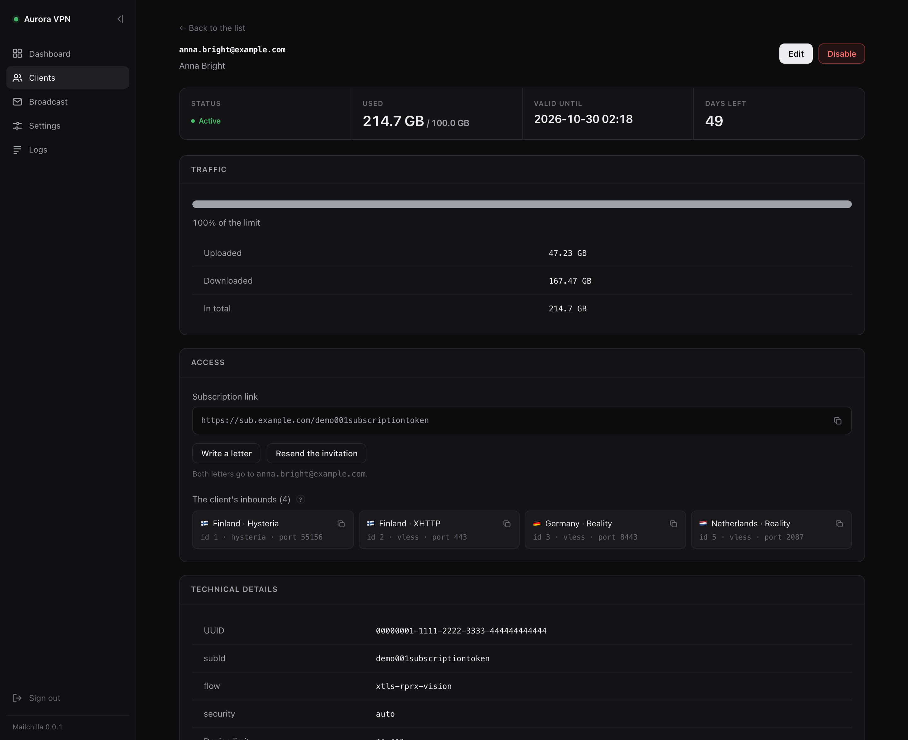
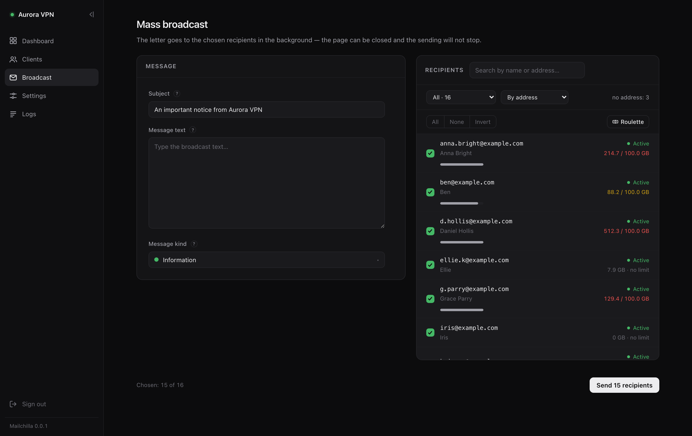
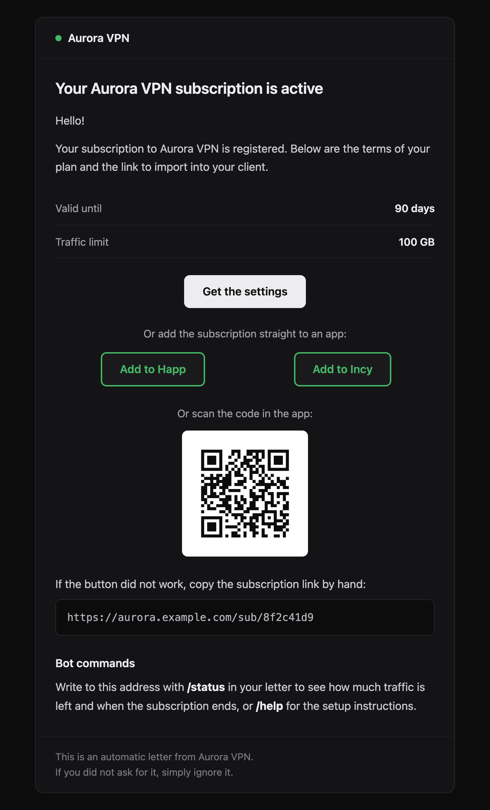
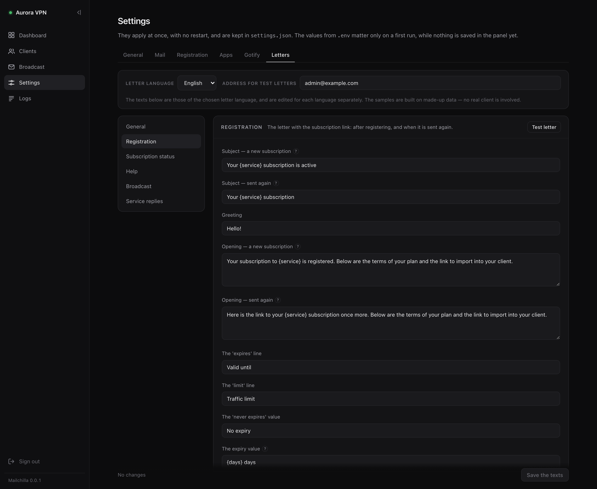
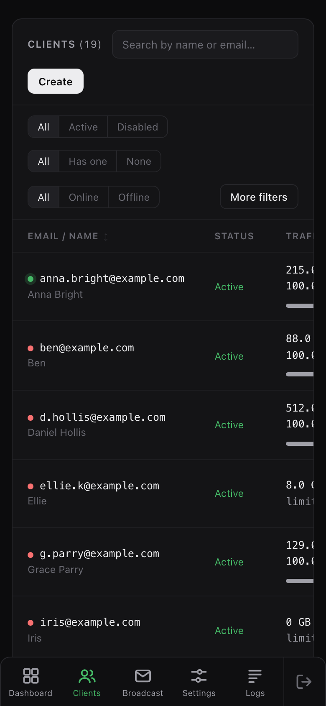
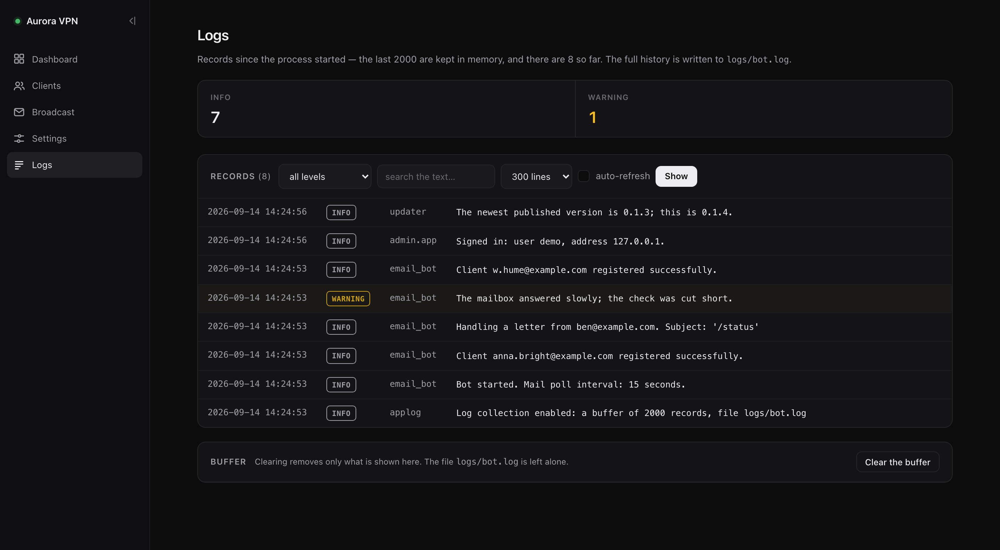
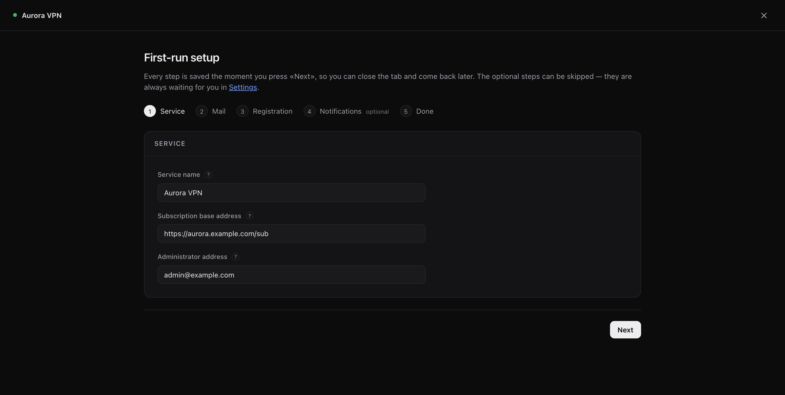
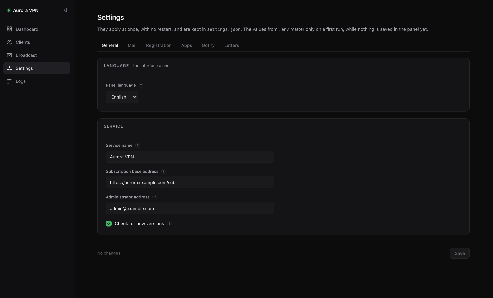

<h1 align="center">Mailchilla</h1>

<p align="center">
Почтовый бот и веб-панель для <a href="https://github.com/MHSanaei/3x-ui">3x-ui</a>
</p>

<p align="center">


</p>

<p align="center">
<a href="README.md">English</a> · Русский
</p>

---

Пользователь пишет письмо с кодовым словом - получает готовую подписку. Админу открывать 3x-ui не нужно.

Проект начался с того, что надо было раздать подписки знакомым. Делать это через админку 3x-ui вручную - мучение, а Telegram-бот не вариант: как выдать подписку человеку, для которого Telegram заблокирован в РФ? Получается замкнутый круг - чтобы добраться до бота, который выдаёт подписку, подписка уже нужна. Почта работает у всех, без VPN и обходов. Вот через неё и сделано.



---

## Содержание

- [Возможности](#-возможности)
- [Быстрый старт](#-быстрый-старт)
- [Первый запуск](#-первый-запуск)
- [Тарифы](#-тарифы)
- [Настройки](#-настройки)
- [Доступ к панели](#-доступ-к-панели)
- [Управление](#-управление)
- [Обновление](#-обновление)
- [Как устроено](#-как-устроено)
- [Разработка](#-разработка)
- [Лицензия](#-лицензия)

---

## 📬 Возможности

**📧 Почтовый бот**

Пишешь письмо с командой (в теме или в тексте) - бот обрабатывает и отвечает.

| Команда | Что делает |
|---|---|
| кодовое слово | заводит клиента в 3x-ui, присылает ссылку подписки |
| `/status` | остаток трафика, срок, статус |
| `/help` | инструкция по настройке клиентов |
| `/broadcast` | рассылка всем активным (только от админа) |

Имя отправителя попадает в комментарий клиента - в списке видно людей, а не адреса. Для всех, кто зарегистрировался раньше, одна кнопка на вкладке «Почта» читает имена из уже лежащих в ящике писем и предлагает таблицу: кому проставить.

**🖥️ Веб-панель**



- Тарифы: трафик, срок и inbound'ы, у каждого своё кодовое слово. Сколько угодно, и клиента, заводимого руками, можно создать по тарифу
- Список клиентов с живым поиском, сортировкой и фильтрами (статус, почта, подключение, период, трафик)
- Кто сейчас на связи - точкой рядом с адресом: зелёная дышит, красная стоит. В списке, в карточке клиента и в списке получателей рассылки. Обновляется сама раз в двадцать секунд, ничего на странице не трогая
- **Был в сети**, отдельным столбцом и строкой в карточке: минуты и часы, пока свежо, дата - когда прошло больше недели, прочерк - для тех, кто не подключался ни разу. Точный момент в подсказке, столбец сортируется - так что те, кто перестал пользоваться, находятся в два клика
- Дашборд начинается с самой машины: процессор, память, диск, аптайм, состояние xray и сколько клиентов сейчас на связи. Может обновляться сам раз в несколько секунд или по кнопке. Рядом - как себя чувствует почтовый цикл: бот, который тихо перестал читать ящик, иначе выглядит ровно как ящик, в который никто не пишет
- Карточка клиента: трафик, срок, ссылка подписки, состав inbound'ов - даже выключенных и удалённых из панели
- У каждого inbound'а своя готовая ссылка подключения - та же строка, что отдаёт кнопка «копировать» в самой 3x-ui. Копируется одним кликом
- Ручное создание, изменение лимита, срока и состава inbound'ов, отключение
- Повторное приглашение и личное письмо - из карточки



**📢 Рассылки**



Письмо выбранным получателям или всем активным. Отправка в фоне, страница показывает прогресс, закрытие вкладки не ломает. Тип сообщения задаёт цвет полосы в письме: обычное, информация, предупреждение, срочное.

Список получателей: поиск, фильтры (активные, отключённые, лимит исчерпан, трафик на исходе), сортировка. «Все» и «Никого» действуют на то, что осталось после фильтра - набрать «всех, у кого кончился трафик» можно в два движения.

И совершенно несерьёзное: кнопка **«Рулетка»** раскатывает показанных получателей лентой, как открытие кейса в CS:GO, с цветами редкости, и оставляет отмеченным ровно одного. Редкость назначается по съеденному трафику, так что золото достаётся самому прожорливому.

**💌 Письма**



Вёрстка на таблицах с инлайн-стилями, плоские цвета, текстовая версия в каждом письме. Доходит одинаково в Gmail, мобильных клиентах и Outlook.

В приветственном письме есть QR-код со ссылкой подписки - для тех, кто открыл почту на компьютере и иначе переносил бы ссылку на телефон руками. Код рисуется на сервере и едет внутри письма: ничей сервис генерации QR не получает ссылки подписок ваших пользователей.

Все тексты редактируются из панели: темы, заголовки, подписи, подвал, служебные сообщения. У каждого письма - кнопка тестовой отправки.



**📱 С телефона**



Панелью можно пользоваться с телефона, а не просто открыть её там. Боковое меню превращается в панель снизу, где ссылки не отнимают ширину и оказываются там, где и так лежит большой палец. Таблицы прокручиваются вбок внутри своей рамки, не утаскивая за собой страницу, а редактор писем, фильтры и рассылка складываются в одну колонку.

**🌍 Два языка**

Интерфейс говорит по-русски и по-английски. Письма тоже - и выбирается это отдельно, так что панель на английском может рассылать письма по-русски. Обычная ситуация, когда администрируешь на одном языке, а читают у тебя на другом.

Строки интерфейса лежат в `lang/`, тексты писем - в самой панели, своим набором на каждый язык. Правка английского приветственного письма русское не трогает.

**📋 Логи и уведомления**



Логи процесса в браузере: фильтр по уровню, поиск, трассировки исключений. Непрочитанные предупреждения поднимаются на дашборд. Push в Gotify при каждой регистрации.

Панель ещё замечает, когда вышла новая версия, и говорит об этом плашкой - со ссылкой на изменения и командой обновления. Сама она ничего не обновляет, а проверку можно выключить.

---

## 🚀 Быстрый старт

Одна команда на чистом сервере с доступной панелью 3x-ui:

```bash
bash <(curl -Ls https://raw.githubusercontent.com/vogster/3x-ui-mailchilla-bot/main/install.sh)
```

Установщик сначала спросит язык, затем доступ к 3x-ui и вход в собственную панель, а остальное сделает сам: пакеты, системный пользователь, последняя выпущенная версия в `/opt/mailchilla`, виртуальное окружение, `.env`, служба systemd и команда `mailchilla`. В конце напечатает адрес, пароль и команду туннеля.

Debian 11+, Ubuntu 22.04+, CentOS/AlmaLinux/Rocky/Fedora. Нужен Python 3.9 или новее - в Ubuntu 20.04 идёт 3.8, и установщик об этом скажет, а не оставит наполовину поставленную копию.

Запускать скрипт из интернета от root стоит, посмотрев на него. Если так спокойнее:

```bash
curl -LO https://raw.githubusercontent.com/vogster/3x-ui-mailchilla-bot/main/install.sh && less install.sh && sudo bash install.sh
```

<details>
<summary><b>Установка вручную</b></summary>

Python 3.9+, доступ к панели 3x-ui.

```bash
git clone https://github.com/vogster/3x-ui-mailchilla-bot.git mailchilla
cd mailchilla
python3 -m venv venv
source venv/bin/activate
pip install -r requirements.txt
cp .env.example .env
# заполнить XUI_URL, XUI_USERNAME, XUI_PASSWORD (или XUI_API_TOKEN)
# заполнить ADMIN_PANEL_USER, ADMIN_PANEL_PASSWORD
# сгенерировать ADMIN_PANEL_SECRET: openssl rand -hex 32
python run.py
```

</details>

Одной командой поднимается и бот, и панель. Панель поднимается всегда - настраивать проект больше негде. Если нужен только бот: `python email_bot.py`.

В `.env` лежит только то, что нужно до запуска панели: доступ к 3x-ui, её собственный вход, адрес и настройки логов. Всё остальное - ящик, язык, Gotify - настраивается в панели после первого входа и хранится в `settings.json`, а то, что получает клиент, живёт рядом в тарифах.

---

## ⚙️ Первый запуск

Свежая копия ничего не знает про ваш ящик и inbound'ы. После первого входа наверху висит плашка с предложением пройти настройку.



Мастер идёт по шагам: сервис, почта, inbound'ы и первый тариф, затем необязательные уведомления и приложения. Каждый шаг сохраняется сразу - закрытая вкладка ничего не теряет. На шаге с почтой работает проверка подключения.

Кнопка «Настрою сам» убирает плашку. Мастер - это те же поля настроек, разложенные по порядку.

---

## 🎟️ Тарифы

Тариф - это то, что получает клиент: трафик, срок и inbound'ы, в которые его добавляют. У каждого своё кодовое слово, и письмо с этим словом заводит отправителя именно на этом тарифе. Тарифов может быть сколько угодно - щедрый для своих, маленький пробный, закрытый вообще без слова.

| Поле | Что значит |
|---|---|
| Название | для вас; под ним тариф виден в панели и в логах |
| Кодовое слово | слово, которое должно быть в письме. Не повторяется у разных тарифов, ищется целиком |
| Лимит трафика | в ГБ; 0 - без ограничения |
| Срок подписки | в днях; 0 - бессрочно |
| Inbound'ы | клиент добавляется в каждый из них, по порядку |

Дашборд считает, сколько человек на каком тарифе и сколько они съели, рассылку можно сузить до одного тарифа, а `/status` называет клиенту его тариф. У каждого тарифа и каждого кода своя карточка: у тарифа видно, кто на нём сейчас, у кода — все, кто по нему пришёл, и от каждого один клик до его собственной карточки.

**Кто на каком тарифе — хранится в самой 3x-ui**, в группе клиента, названной по тарифу. Ничего не нужно держать в согласии: панель 3x-ui показывает ту же группировку, а изменённая там вручную группа — просто правда. В списке клиентов тариф виден рядом с именем, по нему есть фильтр, в том числе «без тарифа» — таким будет всякий, кто зарегистрировался до появления тарифов. Переименование тарифа переименовывает группу и переносит клиентов, поэтому названия тарифов не должны повторяться. Удаление тарифа не трогает его клиентов: лимиты у них свои, а метка переживает тариф - в списке она отмечена пунктиром, а на странице тарифов такие группы собраны в «Группы без тарифа».

**Тариф читается один раз, в момент создания клиента.** Дальше значения живут у клиента в 3x-ui, поэтому правка тарифа ничего не меняет для уже зарегистрированных - он описывает следующего клиента, а не прошлого.

Про слово стоит знать две вещи. Оно ищется целиком, поэтому `START` не найдётся внутри `RESTART`; и ищется только в той части письма, которую человек написал сам, поэтому ответ с процитированным приветственным письмом не считается новой регистрацией. Если в одном письме слова сразу двух тарифов - бот не угадывает, а переспрашивает.

**Кодовые слова — отдельная сущность**, на своей вкладке рядом с тарифами. Код это слово, тариф, который оно открывает, сколько активаций у него осталось, заметка для вас и выключатель:

| Активаций | Что это |
|---|---|
| пусто | слово, которое раздают открыто - сработает у всех, кто его напишет |
| 1 | личное приглашение - гаснет на первом, кто им воспользуется |
| любое число | сработает столько раз |

Это число и есть вся разница между ними, поэтому форма одна. Кнопка **«Сгенерировать»** даёт неугадываемое слово - десять символов без `0`/`O` и `1`/`I`, его будут набирать руками, глядя в экран, - или впишите запоминающееся сами.

У тарифа может быть несколько слов: сезонное рядом с постоянным или по одному на компанию людей. Любое выключается отдельно в тот момент, когда утекло, не задевая ни тариф, ни остальные слова. Выключенный код сохраняет запись о том, кто по нему пришёл; убранный из списка - нет.

Если кодом воспользуется уже зарегистрированный адрес, код не гаснет: человек просто получит свою ссылку заново, а личное приглашение останется тому, кому предназначалось.

Тот, кто уже зарегистрирован, написав чужое слово, просто получит свою ссылку заново. Перевод клиента на другой тариф - решение администратора, а не того, кто узнал слово подороже.

Обновление с 0.1.x ничего не требует: старое кодовое слово, лимит, срок и inbound'ы на первом старте становятся тарифом «Основной», а все, кто зарегистрирован раньше, продолжают работать как работали.

---

## 🔧 Настройки

Всё, что меняется при эксплуатации, настраивается в панели и применяется на лету - без перезапуска.



| Вкладка | Что внутри |
|---|---|
| **Основные** | язык интерфейса, название сервиса, базовый адрес подписки, адрес администратора |
| **Почта** | IMAP и SMTP: серверы, порты, логины, пароли, интервал опроса, проверка подключения |
| **Регистрация** | flow и записывать ли имя отправителя в комментарий клиента. Трафик, срок, inbound'ы и кодовое слово живут в тарифе |
| **Приложения** | схемы для кнопок «Добавить в Happ / Incy» в письме |
| **Gotify** | адрес сервера, токен, приоритет, текст уведомления |
| **Письма** | язык, на котором уходят письма, и все тексты всех писем |

На вкладке «Почта» есть проверка: панель входит в ящик по IMAP и на SMTP теми значениями, что в полях (сохранять не нужно), и показывает результат по шагам. Если задан адрес админа - уходит проверочное письмо.

Настройки хранятся в `settings.json`, тексты писем - в `email_texts.json`, тарифы - в `tariffs.json`, все три рядом с проектом. Почтовый ящик подхватывается на следующем цикле опроса.

**Секреты.** Пароли ящика и токен Gotify редактируются в панели. Пароли показаны точками и ничем больше, у токена видно по нескольку символов с краёв, чтобы отличить один от другого, и то и другое открывается кнопкой с глазом. В разметку страницы настоящее значение не попадает, оно запрашивается отдельно. Поэтому `settings.json` содержит секреты: файл в `.gitignore`, не давайте на него лишних прав.

---

## 🔐 Доступ к панели

По умолчанию `127.0.0.1:8080` - снаружи не открыть.

```bash
ssh -L 8080:127.0.0.1:8080 user@your-server
```

Открыть `http://localhost:8080`.


Альтернатива - reverse proxy с HTTPS. Ставить `ADMIN_PANEL_HOST=0.0.0.0` без этого не стоит.

---

## 🖥️ Управление

Команда `mailchilla` без аргументов открывает меню, а с аргументом выполняет то же самое действие - так она годится и для рук, и для скрипта.

```bash
mailchilla
```

| | |
|---|---|
| `mailchilla status` | служба, версия, отвечает ли панель |
| `mailchilla restart` | а также `start`, `stop` |
| `mailchilla log` | журнал, с продолжением |
| `mailchilla update` | проверить и поставить новую версию |
| `mailchilla passwd` | сменить логин или пароль панели |
| `mailchilla port` | сменить порт |
| `mailchilla tunnel` | готовая команда SSH-туннеля |
| `mailchilla check` | войти в 3x-ui и доложить |
| `mailchilla backup` | копия конфигурации в `/opt/mailchilla-backups` |
| `mailchilla uninstall` | удалить всё |

`status` - это не `systemctl is-active`: с `Restart=always` служба, падающая в цикле, выглядит работающей, поэтому панель спрашивают по HTTP.

Забыли пароль от панели? Он лежит в `.env`, и без него панель вообще не стартует - `mailchilla passwd` задаёт новый и перезапускает.

<details>
<summary><b>Юнит systemd для ручной установки</b></summary>

```ini
[Unit]
Description=Mailchilla
After=network-online.target
Wants=network-online.target

[Service]
Type=simple
User=bot
WorkingDirectory=/opt/mailchilla
ExecStart=/opt/mailchilla/venv/bin/python run.py
Restart=always
RestartSec=10

[Install]
WantedBy=multi-user.target
```

Две вещи, на которых легко споткнуться:

- **Не используйте `EnvironmentFile` для `.env`.** Приложение читает его само через python-dotenv, а systemd разбирает по своим правилам - два парсера на одном файле разойдутся.
- **Пользователю нужны права на запись** в каталог проекта: туда пишутся `settings.json`, `email_texts.json`, `tariffs.json` и `logs/`.

</details>

---

## ⬆️ Обновление

```bash
mailchilla update
```

Версии - это теги, а не верхушка ветки: команда спрашивает у GitHub самый свежий `vX.Y.Z`, показывает изменения из `CHANGELOG.md` и ждёт подтверждения.

Прежде чем что-то трогать, она копирует `.env`, `settings.json`, `email_texts.json` и `tariffs.json` в `/opt/mailchilla-backups/<дата>/`. Если после перезапуска панель не отвечает - возвращается на прежнюю версию и восстанавливает их.

Файлы, поправленные на сервере (например, шаблон), не блокируют обновление: они откладываются через `git stash`, и команда скажет, как их вернуть.

Новые настройки и новые тексты писем не требуют миграции: отсутствующий в `settings.json` ключ берётся из умолчания в `config.py`, а `email_texts.json` хранит только то, что реально отличается от исходного текста. Тарифы тоже: установке без `tariffs.json` он собирается из кодового слова и лимитов, которые у неё уже были.

Для ручной установки прежний путь остаётся: `git pull` и `systemctl restart`.

---

## 📁 Как устроено

Собственной базы данных нет. Источник истины - панель 3x-ui, состояние клиентов читается оттуда. Это избавляет от рассинхронизации, но означает, что панель должна быть доступна.

| Файл | Назначение |
|---|---|
| `install.sh` | установщик: одна команда, русский или английский |
| `mailchilla.sh` | управление установленной копией: меню и подкоманды |
| `run.py` | точка входа: бот в фоновом потоке, панель в основном |
| `email_bot.py` | опрос IMAP, разбор писем, команды, отправка |
| `xui_client.py` | клиент API 3x-ui |
| `templates.py` | сборка писем на Jinja2 - HTML и текстовая версия |
| `email_texts.py` | редактируемые тексты писем, свой набор на каждый язык |
| `i18n.py` | переводчик интерфейса: поиск по каталогу и два языковых параметра |
| `lang/` | каталоги интерфейса, по модулю на язык |
| `settings.py` | настройки поверх `.env` |
| `tariffs.py` | тарифы и кодовые слова, которые их открывают |
| `config.py` | переменные окружения |
| `applog.py` | сбор логов в буфер и файл |
| `admin/` | веб-панель на FastAPI |
| `email_templates/` | шаблоны писем |

---

## 🛠️ Разработка

Форки и пул-реквесты приветствуются. Основная ветка - `main`.

```bash
git checkout -b feature/my-feature
# ...
git push origin feature/my-feature
# открыть pull request на GitHub
```

---

## 📄 Лицензия

MIT - см. [LICENSE](LICENSE).
